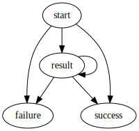

# pipeline-runtime

The [src/index.ts](./src/index.ts) script starts a kafka consumer on topic `pipeline-evaluate` that receives pipeline graphs and evaluates the blocks in topological order.

The worker emits JSON events on topic `pipeline-evaluate-event`. Each event has a `.event` property that is one of `start`, `result`, `failure`, or `success`. Every pipeline execution begins with a `start` event and ends with _either_ a `failure` or `success` event, with zero or more `result` events in-between.



The `failure` event carries a `ValidateError` object, which is one of these types:

```typescript
type ValidateError = GraphError | NodeError | EdgeError

type GraphError = { type: "validate/graph"; message: string }
type NodeError = { type: "validate/node"; id: string; message: string }
type EdgeError = { type: "validate/edge"; id: string; message: string }
```
